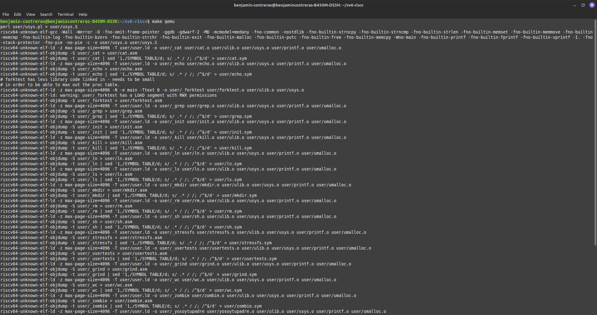
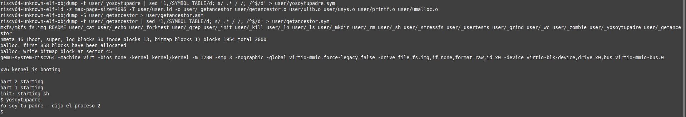
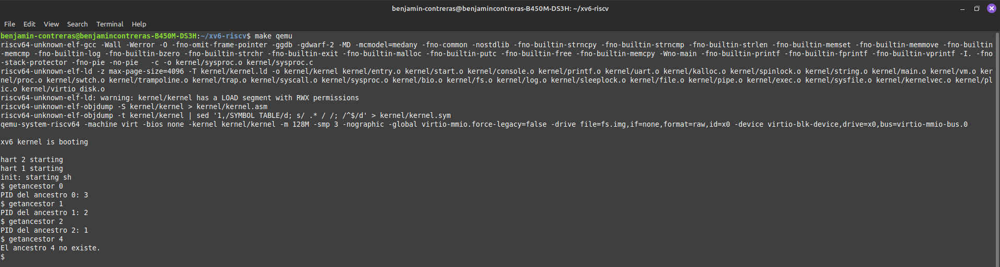

# Informe Tarea 1

### Alumno: Benjamin Contreras

### Objetivo: Implementar y modificar llamadas al sistema en xv6, un sistema operativo educativo.

#### **_El desarrollo de esta tarea fue hecho en un sistema operativo Linux Mint 21.3_**

## Parte 1

#### En esta parte hay que crear una nueva llamada al sistema, la cual llamaremos `int getancestor(int)`. Esta debe retornar el ID del proceso padre que la invoca.

#### Primero debemos definir la nueva llamada de sistema dentro del kernel xv6. Para esto se realizaron los siguientes pasos:

1.  Definimos un numero para la nueva llamada de sistema:

    Para esto debemos modificar el archivo `syscall.h` ubicado en `kernel/syscall.h`

    ```c
    // System call numbers
    ...
    #define SYS_mkdir  20
    #define SYS_close  21
    #define SYS_getppid 22 // Nueva llamada de sistema
    ```

2.  Agregamos la el handler de la llamada de sistema. Esta es la funcion dentro del kernel (xv6) encargada de llevar a cabo el servicio solicitado por un programa de usuario.

    Para esto debemos modificar el archivo `syscall.c` ubicado en `kernel/syscall.c`

    Primero definimos un prototipo de la funcion

    ```c
    ...
    // Prototypes for the functions that handle system calls.
    extern uint64 sys_getancestor(void);
    ...
    // An array mapping syscall numbers from syscall.h
    // to the function that handles the system call.
    static uint64 (*syscalls[])(void) = {
    ...
    [SYS_mkdir]   sys_mkdir,
    [SYS_close]   sys_close,
    [SYS_getppid] sys_getppid, // Prototipo de la nueva llamada de sistema
    };
    ```

3.  Realizamos la implementacion de la nueva llamada de sistema.

    Para esto agregamos el codigo de la implementacion al final del archivo `kernel/sysproc.c`

    ```c
    uint64 sys_getppid(void) {
        struct proc *p = myproc();
        return p->parent->pid;
    }
    ```

    Utilizamos la funcion `myproc()` para acceder a un puntero de la estructura del proceso actual. Aqui tenemos acceso al elemento parent de la estructura, que contiene un puntero a la estructura del proceso padre. De aqui podemos acceder al elemento pid que contiene el ID del proceso.

#### Ahora debemos exponer la llamada de sistema al espacio de usuario para poder asi llamarla con algun programa de usuario. Luego creamos un programa de prueba llamado `yosoytupadre.c` el cual muestra en consola el PID del proceso padre.

#### Estos fueron los pasos para conseguir esto:

1. Modificar `usys.pl` ubicado en `user/usys.pl`. Este archivo es un script en Perl el cual permite a los usuarios invocar llamadas de sistema. Tenemos que agregar nuestra nueva llamada aqui.

    ```perl
    # Al final del archivo
    ...
    entry("uptime");
    entry("getppid"); # Nueva llamada de sistema
    ```

2. Declaramos nuestra nueva llamada en el archivo header `user/user.h`
    ```c
    // system calls
    ...
    int sleep(int);
    int uptime(void);
    int getppid(void); // Nueva llamada de sistema
    ```
3. Creamos el programa `yosoytupadre.c`. Lo creamos en `user/yosoytupadre.c`

    ```c
    #include "kernel/types.h"
    #include "kernel/stat.h"
    #include "user/user.h"

    int main(void) {
        int ppid = getppid();
        printf("Yo soy tu padre - dijo el proceso %d\n", ppid);
        exit(0);
    }
    ```

4. Modificamos el Makefile para que se incluya nuestra llamada de sistema en el "build process".

    ```makefile
    UPROGS=\
    $U/_cat\
    $U/_echo\
    $U/_forktest\
    $U/_grep\
    $U/_init\
    $U/_kill\
    $U/_ln\
    $U/_ls\
    $U/_mkdir\
    $U/_rm\
    $U/_sh\
    $U/_stressfs\
    $U/_usertests\
    $U/_grind\
    $U/_wc\
    $U/_zombie\
    $U/_yosoytupadre\ # Implementacion de la nueva llamada de sistema
    ```

5. Finalmente reconstruimos xv6 y ejecutamos nuestro programa de prueba via la terminal.

    ```sh
    make clean
    make qemu
    ```

    En la terminal de xv6

    ```sh
    $ yosoytupadre
    ```

### Imagenes de la demostracion




## Parte II: Implementacion Avanzada

#### Ahora crearemos otra llamada de sistema, definida como `int getancestor(int)` que retorne el ancestro indicado en el parámetro.

#### Se repiten varios pasos de la primera parte, por ende solo se explicará lo modificado.

1.  Definimos un numero para la nueva llamada de sistema en `syscall.h`.

    ```c
    #define SYS_getancestor 24

    ```

2.  Se agrega el "system call handler" en `syscall.c`:
    ```c
    ...
    // Prototypes for the functions that handle system calls.
    extern uint64 sys_getancestor(void);
    ...
    // An array mapping syscall numbers from syscall.h
    // to the function that handles the system call.
    static uint64 (*syscalls[])(void) = {
    ...
    [SYS_close]   sys_close,
    [SYS_getppid] sys_getppid,
    [SYS_getancestor] sys_getancestor, // Prototipo de la nueva llamada de sistema
    };
    ```
3.  Se implementa la llamada de sistema en `sysproc.c`:

    ```c
    uint64
    sys_getancestor(void) {
    int n;
    struct proc *p;

    argint(0, &n);
    if (n < 0 ) {
        return -1;
    }
    p = myproc();

    for(int i=0; i < n; i++){
        if(p->parent == 0) {
        return -1;
        }
        p = p->parent;
    }
    return p->pid;
    }
    ```

    `argint(0,&n)` recive el primer argumento pasado a la llamada de sistema. Este será un número (int) el cual indicará la cantidad de ancestros se tiene que subir. Este numero se le asigna a n (por eso el uso de &n). Luego con un ciclo for, vamos iterando por la cantidad de ancestros indicada por el argumento pasado a la llamada (n). Este ciclo en cada iteracion va actualizando el puntero del processo al de su padre. Asi se continua hasta llegar al acestro indicado. Si el puntero al proceso padre es 0, significa que este no existe y no hay la cantidad ancestros indicada por el argumento pasado a la llamada.

#### Exponemos la llamada al espacio del usuario. Luego creamos un programa de prueba y modificamos el "Makefile"

4. Modificamos `usys.pl`:

    ```perl
    entry("uptime");
    entry("getppid");
    entry("getancestor"); # Nueva llamada de sistema

    ```

5. Modificamos `user.h` :

    ```c
    // system calls
    ...
    int getancestor(int n);

    ```

6. Creamos el programa de prueba, `getancestor.c`:

    ```c
    #include "kernel/types.h"
    #include "kernel/stat.h"
    #include "user/user.h"

    int main(int argc, char *argv[]) {
        if (argc != 2) {
            printf("Error: Solo se acepta 1 argumento en la consola de comandos.\n");
            exit(1);
        }

        int n= atoi(argv[1]); // Pasamos a int el argumento pasado por consola
        int ancestor_pid = getancestor(n); // Realizamos la llamada de sistema

        if (ancestor_pid == -1) {
            printf("El ancestro %d no existe.\n", n);
        }
        else {
            printf("PID del ancestro %d: %d\n", n, ancestor_pid);
        }

        exit(0);
    }
    ```

7. Modificamos el "Makefile" :
    ```makefile
    UPROGS=\
    $U/_cat\
    $U/_echo\
    $U/_forktest\
    $U/_grep\
    $U/_init\
    $U/_kill\
    $U/_ln\
    $U/_ls\
    $U/_mkdir\
    $U/_rm\
    $U/_sh\
    $U/_stressfs\
    $U/_usertests\
    $U/_grind\
    $U/_wc\
    $U/_zombie\
    $U/_yosoytupadre\
    $U/_getancestor\ # Programa de prueba para la nueva llamada de sistema
    ```
8. Finalmente reconstruimos xv6 y ejecutamos nuestro programa de prueba via la terminal.

    ```sh
    make clean
    make qemu

    ```

    ```sh
    $ getancestor 0
    $ getancestor 1
    $ getancestor 2
    ```

### Imagenes de la demostracion



## Dificultades encontradas

-   Por algun motivo cada vez que se abre una terminal nueva, se olvidan los PATH de QEMU y RISCV. Para esta tarea simplemente se especificaban los PATH cada vez que se usara una nueva terminal. Solucion temporal:
    ```sh
    export PATH=/opt/riscv/bin:$PATH
    export PATH=/opt/qemu/bin:$PATH
    source ~/.bashrc

    ```
