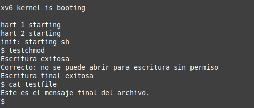
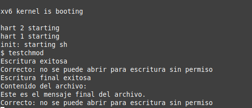

# Informe Tarea 4

## Primera Parte

### 1) Modificacion de la estructura de inode

Primero vamos a file.h donde se encuentra el struct inode y agregamos el campo de permisos llamado perm.

```c
// in-memory copy of an inode
struct inode {
  uint dev;           // Device number
  uint inum;          // Inode number
  int ref;            // Reference count
  struct sleeplock lock; // protects everything below here
  int valid;          // inode has been read from disk?

  short type;         // copy of disk inode
  short major;
  short minor;
  short nlink;
  uint size;
  uint addrs[NDIRECT+1];
  int perm; // Permisos: 0=sin permiso, 1=lectura, 2=escritura, 3=lectura/escritur
};
```

Luego debemos modicar el inode que se almacena en disco, llamado dinode. Para esto vamos a fs.h y agregamos el campo perm.

```c
// in-memory copy of an inode
struct inode {
  uint dev;           // Device number
  uint inum;          // Inode number
  int ref;            // Reference count
  struct sleeplock lock; // protects everything below here
  int valid;          // inode has been read from disk?

  short type;         // copy of disk inode
  short major;
  short minor;
  short nlink;
  uint size;
  uint addrs[NDIRECT+1];
  int perm; // Permisos: 0=sin permiso, 1=lectura, 2=escritura, 3=lectura/escritura
};
```

Ahora no tenemos que asegurar que la informacion de los permisos se comparta en el inode en memoria (inode) y en disco (dinode).
Para esto vamos a fs.h y modificamos ilock, que lee el inode del disco, agregando el campo perm para la lectura.

```c
// Lock the given inode.
// Reads the inode from disk if necessary.
void
ilock(struct inode *ip)
{
  struct buf *bp;
  struct dinode *dip;

  if(ip == 0 || ip->ref < 1)
    panic("ilock");

  acquiresleep(&ip->lock);

  if(ip->valid == 0){
    bp = bread(ip->dev, IBLOCK(ip->inum, sb));
    dip = (struct dinode*)bp->data + ip->inum%IPB;
    ip->type = dip->type;
    ip->major = dip->major;
    ip->minor = dip->minor;
    ip->nlink = dip->nlink;
    ip->size = dip->size;
    ip->perm = dip->perm; // Leer el campo perm desde el disco
    memmove(ip->addrs, dip->addrs, sizeof(ip->addrs));
    brelse(bp);
    ip->valid = 1;
    if(ip->type == 0)
      panic("ilock: no type");
  }
}

```

Despues modifcamos ialloc, que se encarga de asignar memoria para el inode, agregando el campo perm.

```c
// Allocate an inode on device dev.
// Mark it as allocated by  giving it type type.
// Returns an unlocked but allocated and referenced inode,
// or NULL if there is no free inode.
struct inode*
ialloc(uint dev, short type)
{
  int inum;
  struct buf *bp;
  struct dinode *dip;

  for(inum = 1; inum < sb.ninodes; inum++){
    bp = bread(dev, IBLOCK(inum, sb));
    dip = (struct dinode*)bp->data + inum%IPB;
    if(dip->type == 0){  // a free inode
      memset(dip, 0, sizeof(*dip));
      dip->type = type;
      dip->perm = 3; // Inicializar perm con valor 3
      log_write(bp);   // mark it allocated on the disk
      brelse(bp);
      return iget(dev, inum);
    }
    brelse(bp);
  }
  printf("ialloc: no inodes\n");
  return 0;
}
```

### 2) Modificar las operaciones de apertura, lectura y escritura:

Primero vamos a modificar sys_open encargada de la apertura de archivos, Esta funcion se encuentra en kernel/sysfile.c . Aqui agregaremos las restricciones para los disintos permisos. Haciendo la operacion bitwise con & nos aseguramos que perm = sea un caso valido para escritura y lectura.

```c
uint64
sys_open(void)
{
    ...
    ilock(ip);
    if(ip->type == T_DIR && omode != O_RDONLY){
      iunlockput(ip);
      end_op();
      return -1;
    }
    if((omode & O_WRONLY) && !(ip->perm & 2)){
      iunlockput(ip);
      return -1; // No tiene permiso de escritura
    }
    if((omode & O_RDONLY) && !(ip->perm & 1)){
      iunlockput(ip);
      return -1; // No tiene permiso de lectura
    }
    ...
}
```

Luego vamos a kernel/file.c para modificar las funciones fileread y filewrite encargadas de la escritura y lectura de arhcivos.
Primero en fileread agregamos la restriccion para el permiso de lectura:

```c
// Read from file f.
// addr is a user virtual address.
int
fileread(struct file *f, uint64 addr, int n)
{
  int r = 0;

  if(f->readable == 0 || !(f->ip->perm & 1))
    return -1; // No tiene permiso de lectura

  if(f->type == FD_PIPE){
    r = piperead(f->pipe, addr, n);
  } else if(f->type == FD_DEVICE){
    if(f->major < 0 || f->major >= NDEV || !devsw[f->major].read)
      return -1;
    r = devsw[f->major].read(1, addr, n);
  } else if(f->type == FD_INODE){
    ilock(f->ip);
    if((r = readi(f->ip, 1, addr, f->off, n)) > 0)
      f->off += r;
    iunlock(f->ip);
  } else {
    panic("fileread");
  }

  return r;
}
```

Luego hacemos lo mismo para filewrite:

```c
// Write to file f.
// addr is a user virtual address.
int
filewrite(struct file *f, uint64 addr, int n)
{
  int r, ret = 0;

  if(f->writable == 0 || !(f->ip->perm & 2))
    return -1; // No tiene permiso de escritura

...
}
```

### 3) Crear la llamada al sistema chmod(archivo:char\*, modo:int)

Para crear la llamada al sistema primero la definimos junto al resto de las llamadas en kernel/syscall.h

```c
// System call numbers
#define SYS_fork    1
#define SYS_exit    2
#define SYS_wait    3
#define SYS_pipe    4
#define SYS_read    5
#define SYS_kill    6
#define SYS_exec    7
#define SYS_fstat   8
#define SYS_chdir   9
#define SYS_dup    10
#define SYS_getpid 11
#define SYS_sbrk   12
#define SYS_sleep  13
#define SYS_uptime 14
#define SYS_open   15
#define SYS_write  16
#define SYS_mknod  17
#define SYS_unlink 18
#define SYS_link   19
#define SYS_mkdir  20
#define SYS_close  21
#define SYS_chmod  22 // Nueva llamada de sistema
```

Luego definimos el prototipo de la llamada en kernel/syscall.c

```c
// Prototypes for the functions that handle system calls.
extern uint64 sys_fork(void);
extern uint64 sys_exit(void);
extern uint64 sys_wait(void);
extern uint64 sys_pipe(void);
extern uint64 sys_read(void);
extern uint64 sys_kill(void);
extern uint64 sys_exec(void);
extern uint64 sys_fstat(void);
extern uint64 sys_chdir(void);
extern uint64 sys_dup(void);
extern uint64 sys_getpid(void);
extern uint64 sys_sbrk(void);
extern uint64 sys_sleep(void);
extern uint64 sys_uptime(void);
extern uint64 sys_open(void);
extern uint64 sys_write(void);
extern uint64 sys_mknod(void);
extern uint64 sys_unlink(void);
extern uint64 sys_link(void);
extern uint64 sys_mkdir(void);
extern uint64 sys_close(void);
extern uint64 sys_chmod(void); // Nueva llamada

// An array mapping syscall numbers from syscall.h
// to the function that handles the system call.
static uint64 (*syscalls[])(void) = {
[SYS_fork]    sys_fork,
[SYS_exit]    sys_exit,
[SYS_wait]    sys_wait,
[SYS_pipe]    sys_pipe,
[SYS_read]    sys_read,
[SYS_kill]    sys_kill,
[SYS_exec]    sys_exec,
[SYS_fstat]   sys_fstat,
[SYS_chdir]   sys_chdir,
[SYS_dup]     sys_dup,
[SYS_getpid]  sys_getpid,
[SYS_sbrk]    sys_sbrk,
[SYS_sleep]   sys_sleep,
[SYS_uptime]  sys_uptime,
[SYS_open]    sys_open,
[SYS_write]   sys_write,
[SYS_mknod]   sys_mknod,
[SYS_unlink]  sys_unlink,
[SYS_link]    sys_link,
[SYS_mkdir]   sys_mkdir,
[SYS_close]   sys_close,
[SYS_chmod]   sys_chmod, // Nueva llamada
};

```

Ahora definimos la implementacion de la llamada chmod en kernel/sysfile.c

```c
uint64
sys_chmod(void)
{
  char path[MAXPATH];
  int mode;
  struct inode *ip;

  argint(1, &mode);
  if(argstr(0, path, MAXPATH) < 0 || mode < 0)
    return -1;

  begin_op();
  if((ip = namei(path)) == 0){
    end_op();
    return -1;
  }
  ip->perm = mode;
  iupdate(ip);
  iunlock(ip);
  end_op();

  return 0;
}
```

Ahora tenemos que hacer disponible sys_chmod para el usuario y asi poder utilizarla en programas de usuario.
Primero definimos la llamada en el archivo de encabezado user/user.h

```c
// system calls
int fork(void);
int exit(int) __attribute__((noreturn));
int wait(int*);
int pipe(int*);
int write(int, const void*, int);
int read(int, void*, int);
int close(int);
int kill(int);
int exec(const char*, char**);
int open(const char*, int);
int mknod(const char*, short, short);
int unlink(const char*);
int fstat(int fd, struct stat*);
int link(const char*, const char*);
int mkdir(const char*);
int chdir(const char*);
int dup(int);
int getpid(void);
char* sbrk(int);
int sleep(int);
int uptime(void);
int chmod(char *path, int mode); // Nueva llamada
```

Tambien tenemos que hacer declarar la llamada en usys.pl, este es un script en perl que permite a los usuarios invocar llamadas de sistema. Para esto hacemos lo siguiente:

```perl
#!/usr/bin/perl -w

# Generate usys.S, the stubs for syscalls.

print "# generated by usys.pl - do not edit\n";

print "#include \"kernel/syscall.h\"\n";

sub entry {
    my $name = shift;
    print ".global $name\n";
    print "${name}:\n";
    print " li a7, SYS_${name}\n";
    print " ecall\n";
    print " ret\n";
}

entry("fork");
entry("exit");
entry("wait");
entry("pipe");
entry("read");
entry("write");
entry("close");
entry("kill");
entry("exec");
entry("open");
entry("mknod");
entry("unlink");
entry("fstat");
entry("link");
entry("mkdir");
entry("chdir");
entry("dup");
entry("getpid");
entry("sbrk");
entry("sleep");
entry("uptime");
entry("chmod"); # Nueva llamada
```

Ya con esto podemos crear un programa para poner a prueba la llamada chmod.

### 4) Pruebas

Creamos un archivo nuevo en ./user , llamaremos a este testchmod.c .
Este es el programa que realiza las indicaciones mencionadas en las instrucciones de la tarea:

```c
#include "kernel/types.h"
#include "kernel/stat.h"
#include "kernel/fcntl.h"
#include "user/user.h"

int main() {
    int fd;
    char *filename = "testfile";
    char *message = "Este es un archivo de prueba.\n";
    char *message2 = "Este es el mensaje final del archivo.\n";
    char buffer[128];
    int n;

    // Crear archivo
    fd = open(filename, O_CREATE | O_RDWR);
    if (fd < 0) {
        printf("Error al crear el archivo\n");
        exit(1);
    }

    // Escribir algo en el archivo
    if (write(fd, message, strlen(message)) != strlen(message)) {
        printf("Error al escribir en el archivo\n");
        close(fd);
        exit(1);
    }
    printf("Escritura exitosa\n");
    close(fd);

    // Cambiar permisos
    if (chmod(filename, 1) < 0) {
        printf("Error al cambiar permisos\n");
        exit(1);
    }

    // Intentar abrir para escritura
    fd = open(filename, O_WRONLY);
    if (fd >= 0) {
        printf("Error: se pudo abrir para escritura sin permiso\n");
        exit(1);
    } else {
        printf("Correcto: no se puede abrir para escritura sin permiso\n");
    }
    close(fd);

    // Cambiar permisos a perm = 3
    if (chmod(filename, 3) < 0) {
        printf("Error al cambiar permisos\n");
        exit(1);
    }

    // Escribir nuevamente algo en el archivo
    fd = open(filename, O_WRONLY);
    if (write(fd, message2, strlen(message2)) != strlen(message2)) {
        printf("Error al escribir en el archivo\n");
        close(fd);
        exit(1);
    }
    printf("Escritura final exitosa\n");
    close(fd);
    exit(0);
}
```

Finalmente agregamos nuestro programa de prueba al Makefile para hacerlo disponible en xv6.

```makefile
...
UPROGS=\
	$U/_cat\
	$U/_echo\
	$U/_forktest\
	$U/_grep\
	$U/_init\
	$U/_kill\
	$U/_ln\
	$U/_ls\
	$U/_mkdir\
	$U/_rm\
	$U/_sh\
	$U/_stressfs\
	$U/_usertests\
	$U/_grind\
	$U/_wc\
	$U/_zombie\
	$U/_testchmod\ # Programa de prueba
...
```

Ahora para realizar la prueba ejecutamos los siguientes comandos (se tiene que estar ubicado en el directorio donde se tenga xv6 para ejecutar los comandos):

```bash
export PATH=/opt/riscv/bin:$PATH
export PATH=/opt/qemu/bin:$PATH
source ~/.bashrc

make clean
make qemu
```



## Segunda Parte

### 1) Agregar un nuevo permiso que haga un archivo inmutable.

Para esto solo es necesario modificar la implementacion de chmod en kernel/sysfile.c

```c
uint64
sys_chmod(void)
{
  char path[MAXPATH];
  int mode;
  struct inode *ip;

  argint(1, &mode);
  if(argstr(0, path, MAXPATH) < 0 || mode < 0)
    return -1;

  begin_op();
  if((ip = namei(path)) == 0){
    end_op();
    return -1;
  }
  // Nueva restriccion para permiso escpecial
  ilock(ip);
    if(ip->perm == 5){
    iunlockput(ip);
    end_op();
    return -1; // No se puede cambiar el permiso de un archivo inmutable
  }
  ip->perm = mode;
  iupdate(ip);
  iunlock(ip);
  end_op();

  return 0;
}
```

Debido al uso de operaciones bitwise en las restricciones de sys_open, fileread y filewrite no es necesario hacer modificaciones a estas.

Ahora agregamos las indicaciones nuevas a nuestro programa de prueba:

```c
#include "kernel/types.h"
#include "kernel/stat.h"
#include "kernel/fcntl.h"
#include "user/user.h"

int main() {
    int fd;
    char *filename = "testfile";
    char *message = "Este es un archivo de prueba.\n";
    char *message2 = "Este es el mensaje final del archivo.\n";
    char buffer[128];
    int n;

    // Crear archivo
    fd = open(filename, O_CREATE | O_RDWR);
    if (fd < 0) {
        printf("Error al crear el archivo\n");
        exit(1);
    }

    // Escribir algo en el archivo
    if (write(fd, message, strlen(message)) != strlen(message)) {
        printf("Error al escribir en el archivo\n");
        close(fd);
        exit(1);
    }
    printf("Escritura exitosa\n");
    close(fd);

    // Cambiar permisos
    if (chmod(filename, 1) < 0) {
        printf("Error al cambiar permisos\n");
        exit(1);
    }

    // Intentar abrir para escritura
    fd = open(filename, O_WRONLY);
    if (fd >= 0) {
        printf("Error: se pudo abrir para escritura sin permiso\n");
        exit(1);
    } else {
        printf("Correcto: no se puede abrir para escritura sin permiso\n");
    }
    close(fd);

    // Cambiar permisos a perm = 3
    if (chmod(filename, 3) < 0) {
        printf("Error al cambiar permisos\n");
        exit(1);
    }

    // Escribir nuevamente algo en el archivo
    fd = open(filename, O_WRONLY);
    if (write(fd, message2, strlen(message2)) != strlen(message2)) {
        printf("Error al escribir en el archivo\n");
        close(fd);
        exit(1);
    }
    printf("Escritura final exitosa\n");
    close(fd);


    // Leer contenido del archivo
    fd = open(filename, O_RDONLY);
    if (fd < 0) {
        printf("Error al abrir el archivo para lectura\n");
        exit(1);
    }
    printf("Contenido del archivo:\n");
    while ((n = read(fd, buffer, sizeof(buffer))) > 0) {
        write(1, buffer, n); // Escribir en stdout
    }

    if (n < 0) {
        printf("Error al leer el archivo\n");
    }
    close(fd);

    //PARTE 2

    // Cambiar permisos a perm = 5 inmutable
    if (chmod(filename, 5) < 0) {
        printf("Error al cambiar permisos\n");
        exit(1);
    }

    // Intentar abrir para escritura
    fd = open(filename, O_WRONLY);
    if (fd >= 0) {
        printf("Error: se pudo abrir para escritura sin permiso\n");
        exit(1);
    } else {
        printf("Correcto: no se puede abrir para escritura sin permiso\n");
    }
    close(fd);

    // Cambiar permisos a perm = 3, deberia fallar porque es inmutable
    if (chmod(filename, 3) > 0) {
        printf("Error: Se cambio el permiso de un archivo inmutable\n");
        exit(1);
    }
    else {
      printf("Correcto: no se puede cambiar el permiso de un archivo inmutable\n");
    }

    exit(0);
}

```

Ejecutando esto en xv6:


